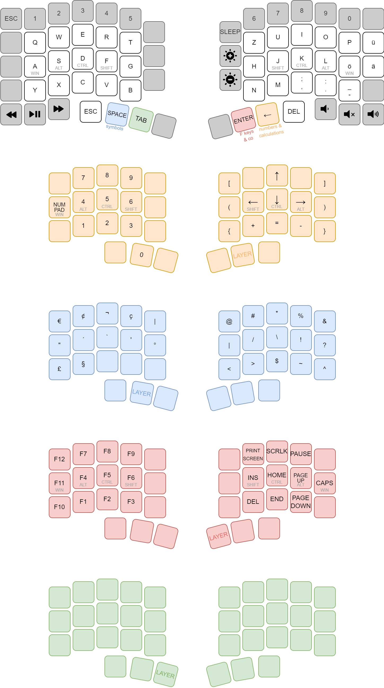

## Ergo68 Resources
* Hardware Info & Manual: [Github](https://github.com/yushakobo/build-documents/tree/master/Ergo68)
* Download Reference [Hex File](https://remap-keys.app/catalog/qIgO7rOq7GMRsGf6QhlY/firmware)
* [Remap Tool](https://qmk018.remap-keys.app/configure)

## QMK Links
* [QMK Configurator](config.qmk.fm)
* QMK Firmware: [Tap-Hold Docs](https://docs.qmk.fm/#/tap_hold)
* QMK Firmware: [Keycodes - Full List](https://docs.qmk.fm/#/keycodes?id=mod-tap-keys)
* [Doc: VIA and QMK Firmware](https://docs.keeb.io/via-technical)

## Commands
```bash
cd qmk_firmware
qmk compile -kb yushakobo/ergo68 -km ch-miryoku-style
leonardoUploader /dev/ttyACM0 .build/yushakobo_ergo68_ch-miryoku-style.hex
```

## Keymapping - CH - Miryoku Layout

```c
const uint16_t PROGMEM keymaps[][MATRIX_ROWS][MATRIX_COLS] = {
        [0] = LAYOUT(
        KC_ESC,     KC_1,           KC_2,           KC_3,           KC_4,           KC_5,                               KC_6,           KC_7,           KC_8,           KC_9,           KC_0,               KC_NO,
        KC_NO,      KC_Q,           KC_W,           KC_E,           KC_R,           KC_T,       KC_NO,      KC_NO,      KC_Y,           KC_U,           KC_I,           KC_O,           KC_P,               KC_LBRC,
        KC_NO,      LGUI_T(KC_A),   LALT_T(KC_S),   LCTL_T(KC_D),   LSFT_T(KC_F),   KC_G,       KC_NO,      KC_NO,      KC_H,           RSFT_T(KC_J),   RCTL_T(KC_K),   RALT_T(KC_L),   RGUI_T(KC_SCLN),    KC_QUOT,
        KC_NO,      KC_Z,           KC_X,           KC_C,           KC_V,           KC_B,       KC_NO,      KC_NO,      KC_N,           KC_M,           KC_COMM,        KC_DOT,         KC_SLSH,            KC_NO,
        KC_NO,      KC_NO,          KC_NO,          KC_ESC,         LT(2,KC_SPC),   KC_TAB,     KC_NO,      KC_NO,      LT(3,KC_ENT),   LT(1,KC_BSPC),  KC_DEL,         KC_NO,          KC_NO,              KC_NO
    ),
        [1] = LAYOUT(
        KC_TRNS,    KC_TRNS,        KC_TRNS,        KC_TRNS,        KC_TRNS,        KC_TRNS,                            KC_TRNS,        KC_TRNS,            KC_TRNS,            KC_TRNS,            KC_TRNS,            KC_TRNS,
        KC_TRNS,    KC_TRNS,        KC_P7,          KC_P8,          KC_P9,          KC_TRNS,    KC_TRNS,    KC_TRNS,    RALT(KC_LBRC),  KC_TRNS,            KC_UP,              KC_TRNS,            RALT(KC_RBRC),      KC_TRNS,
        KC_NUM,     KC_TRNS,        LGUI_T(KC_P4),  LALT_T(KC_P5),  LCTL_T(KC_P6),  KC_TRNS,    KC_TRNS,    KC_TRNS,    LSFT(KC_8),     RSFT_T(KC_LEFT),    RCTL_T(KC_DOWN),    RALT_T(KC_RIGHT),   LSFT(KC_9),         KC_TRNS,
        KC_TRNS,    KC_TRNS,        KC_P1,          KC_P2,          KC_P3,          KC_TRNS,    KC_TRNS,    KC_TRNS,    RALT(KC_QUOT),  KC_PPLS,            KC_PEQL,            KC_PMNS,            RALT(KC_NUHS),      KC_TRNS,
        KC_TRNS,    KC_TRNS,        KC_TRNS,        KC_TRNS,        KC_P0,          KC_TRNS,    KC_TRNS,    KC_TRNS,    KC_TRNS,        KC_TRNS,            KC_TRNS,            KC_TRNS,            KC_TRNS,            KC_TRNS
    ),
        [2] = LAYOUT(
        KC_TRNS,    KC_TRNS,            KC_TRNS,        KC_TRNS,        KC_TRNS,            KC_TRNS,                                KC_TRNS,    KC_TRNS,        KC_TRNS,        KC_TRNS,        KC_TRNS,        KC_TRNS,
        KC_TRNS,    RALT(KC_E),         RALT(KC_8),     RALT(KC_6),     LSFT(KC_4),         RALT(KC_1),     KC_TRNS,    KC_TRNS,    RALT(KC_2), RALT(KC_3),     LSFT(KC_3),     LSFT(KC_5),     LSFT(KC_6),     KC_TRNS,
        KC_TRNS,    LSFT(KC_2),         RALT(KC_MINS),  LSFT(KC_EQL),   LSFT_T(KC_MINS),    LSFT(KC_GRV),   KC_TRNS,    KC_TRNS,    RALT(KC_7), LSFT(KC_7),     RALT(KC_NUBS),  LSFT(KC_RBRC),  LSFT(KC_MINS),  KC_TRNS,
        KC_TRNS,    LSFT(KC_NUHS),      KC_GRV,         KC_TRNS,        KC_TRNS,            KC_TRNS,        KC_TRNS,    KC_TRNS,    KC_NUBS,    LSFT(KC_NUBS),  KC_NUHS,        RALT(KC_EQL),   KC_EQL,         KC_TRNS,
        KC_TRNS,    KC_TRNS,            KC_TRNS,        KC_TRNS,        KC_TRNS,            KC_TRNS,        KC_TRNS,    KC_TRNS,    KC_TRNS,    KC_TRNS,        KC_TRNS,        KC_TRNS,        KC_TRNS,        KC_TRNS
    ),
        [3] = LAYOUT(
        KC_TRNS,    KC_TRNS,        KC_TRNS,        KC_TRNS,        KC_TRNS,        KC_TRNS,                            KC_TRNS,    KC_TRNS,        KC_TRNS,        KC_TRNS,        KC_TRNS,            KC_TRNS,
        KC_TRNS,    KC_F12,         KC_F7,          KC_F8,          KC_F9,          KC_TRNS,    KC_TRNS,    KC_TRNS,    KC_TRNS,    KC_PSCR,        KC_SCRL,        KC_PAUS,        KC_TRNS,            KC_TRNS,
        KC_TRNS,    LGUI_T(KC_F11), LALT_T(KC_F4),  LCTL_T(KC_F5),  LSFT_T(KC_F6),  KC_TRNS,    KC_TRNS,    KC_TRNS,    KC_TRNS,    RSFT_T(KC_INS), RCTL_T(KC_HOME),RALT_T(KC_PGUP),RGUI_T(KC_CAPS),    KC_TRNS,
        KC_TRNS,    KC_F10,         KC_F1,          KC_F2,          KC_F3,          KC_TRNS,    KC_TRNS,    KC_TRNS,    KC_TRNS,    KC_DEL,         KC_END,         KC_PGDN,        KC_TRNS,            KC_TRNS,
        KC_TRNS,    KC_TRNS,        KC_TRNS,        KC_TRNS,        KC_TRNS,        KC_TRNS,    KC_TRNS,    KC_TRNS,    KC_TRNS,    KC_TRNS,        KC_TRNS,        KC_TRNS,        KC_TRNS,            KC_TRNS
    )
};
```
